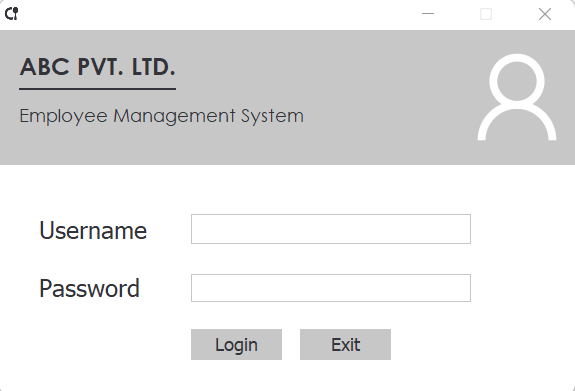
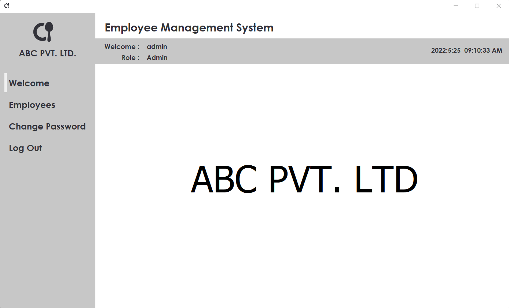
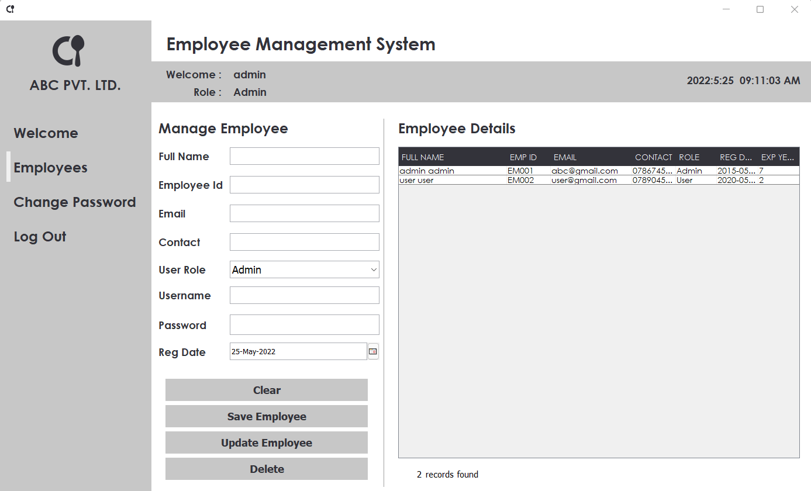
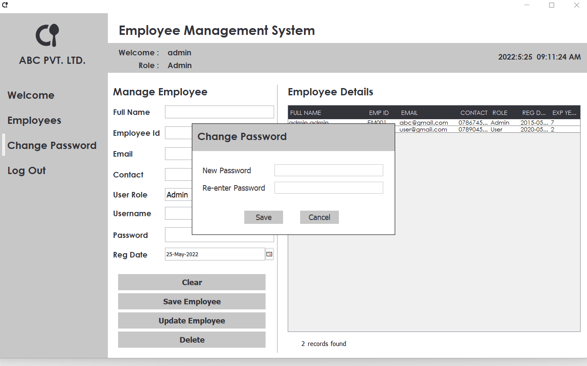
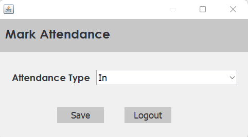

# Employee Managment System

  This is sample employee managment system created using java SE & mySql.

## Executing program
 
  * JDK 1.8 or latest version should be installed in your computer.
  * MySql 8 or latest version should be installed in your computer.
  * First import the backup file in "db-backup" folder.
  * Then update your db informations at db.Db.java file.
  * Now you can run it.

### Contact

Abhishek Peiris - [@AbhishekPeiris](https://twitter.com/AbhishekPeiris) - abhishekpeiris9@gmail.com - [abhishekpeiris](https://www.linkedin.com/in/abhishekpeiris/)

Project Link: [https://github.com/peirisabhi/employee_managment](https://github.com/peirisabhi/employee_managment)

#### Sample Images

